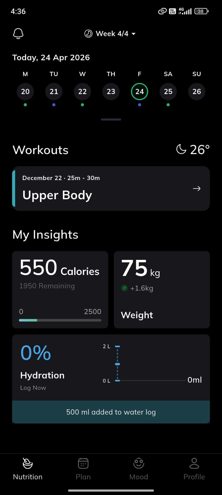
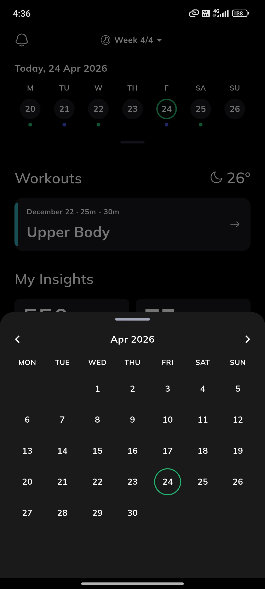
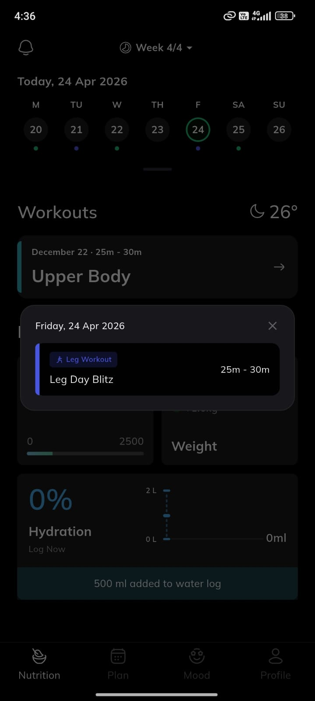
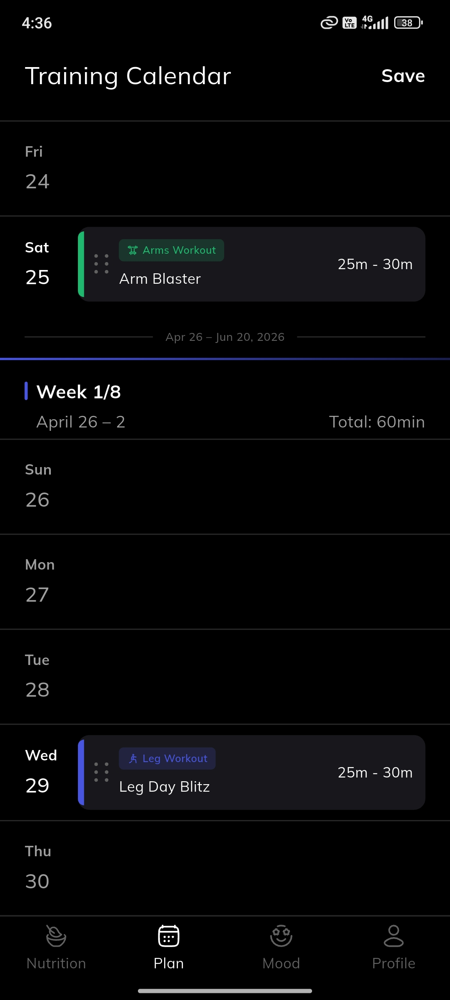
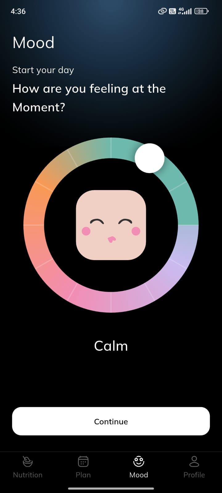
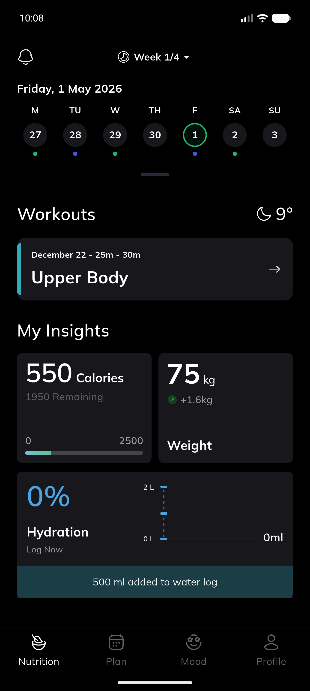
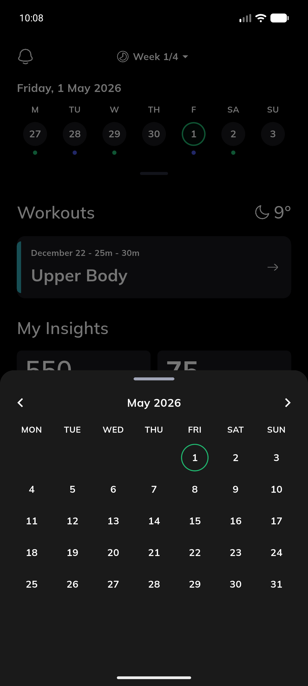
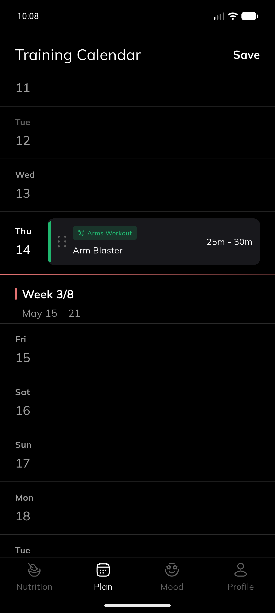
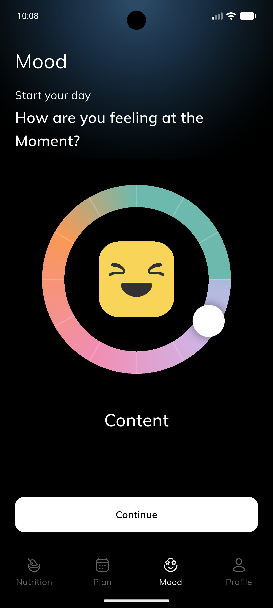
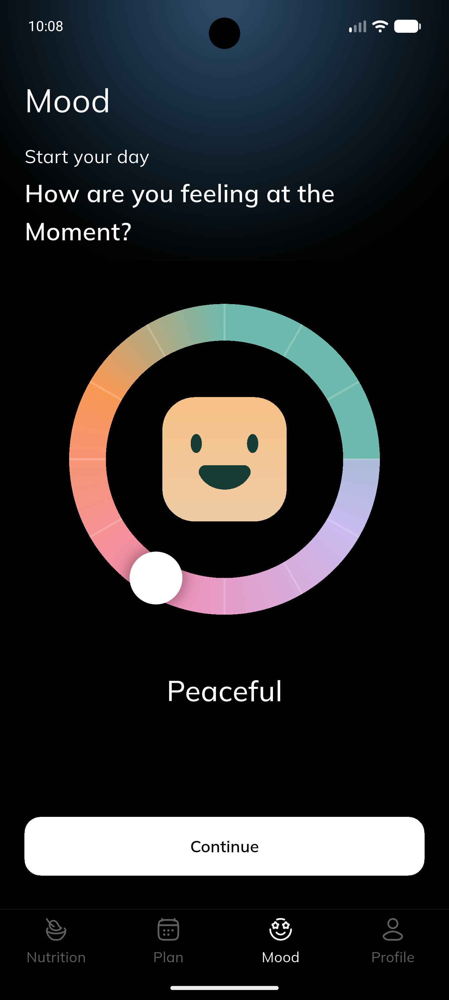

# Shariq Fitness App

A Flutter fitness app built for the Evencir interview test task. The app includes a home dashboard, weekly training calendar, mood selector, and profile tab.

---

## 1. Dependencies Used & Why

### App Dependencies

- `get` - Used for GetX state management across the dashboard, home, plan, and mood screens.
- `flutter_svg` - Used to render SVG icons for bottom navigation, workouts, mood, profile, and dashboard UI.
- `intl` - Used for date formatting in the home screen, calendar, and training plan.

### Dev Dependencies

- `flutter_test` - Used for Flutter widget testing.
- `flutter_lints` - Provides recommended lint rules to keep the code consistent and clean.

Note: The app does not call any network API.

---

## 2. Project Structure

```text
lib/
  main.dart
  core/
    constants/       # App colors, assets, and dimensions
    router/          # Route names and router setup
    theme/           # App theme and text styles
    utils/           # Responsive sizing utilities
  shared/
    widgets/         # Reusable widgets such as AppText
  features/
    main_dashboard/  # Bottom navigation shell and tab controller
    home/            # Home dashboard, week strip, workout card, insights, calendar sheet
    plan/            # Training calendar and draggable workout planner
    mood/            # Mood selector screen and mood controller
    profile/         # Profile screen
```

The project follows a feature-based structure. Each feature keeps its own presentation files, pages, widgets, and GetX controllers close together.

---

## 3. App Screenshots

[View Screenshots](screenshots)

The `screenshots/` folder contains both the original Figma reference screens and the implemented app screenshots. The Figma images are included only for comparison with the final Flutter UI.

### Figma Reference Screens

| Screen            | Figma Reference                                    |
| ----------------- | -------------------------------------------------- |
| Home              |          |
| Calendar          |  |
| Date Tap          |  |
| Training Calendar |          |
| Mood              |          |

### App Screenshots

| Screen            | App Screenshot                                      |
| ----------------- | --------------------------------------------------- |
| Home              |                    |
| Calendar          |            |
| Training Calendar |       |
| Mood - Content    |    |
| Mood - Peaceful   |  |

### UI Comparison

| Figma                                              | App                                               |
| -------------------------------------------------- | ------------------------------------------------- |
|          |                  |
|  |          |
|          |     |
|          |  |

---

## 4. App Video

[Watch App Demo Video](https://drive.google.com/file/d/1LPZ6rhf0ymje0Gr0IEkmAjG-mKRn8H6g/view?usp=sharing)

---

## 5. App APK

[Download APK](https://github.com/ZAMANWAY/testing_1/releases/download/v1.0.0/shariq_test.apk)

Example format:

```text
https://github.com/username/project-name/releases/download/v1.0/app-release.apk
```

---

## Getting Started

```bash
flutter pub get
flutter run
```
